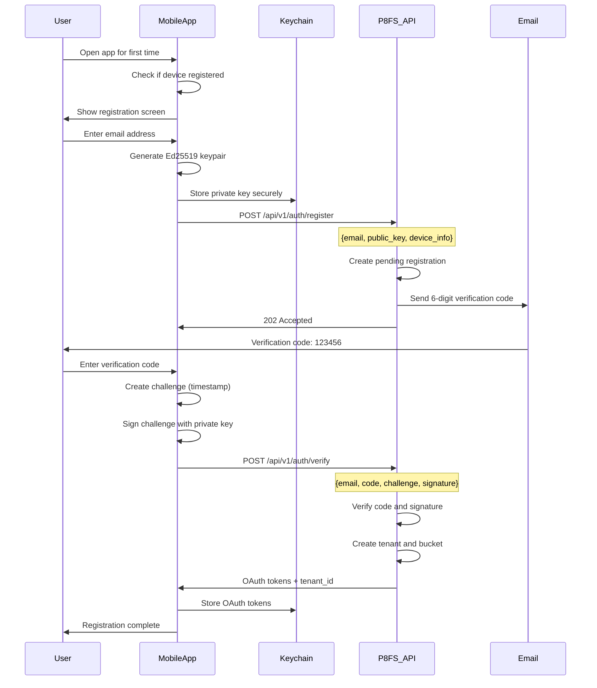
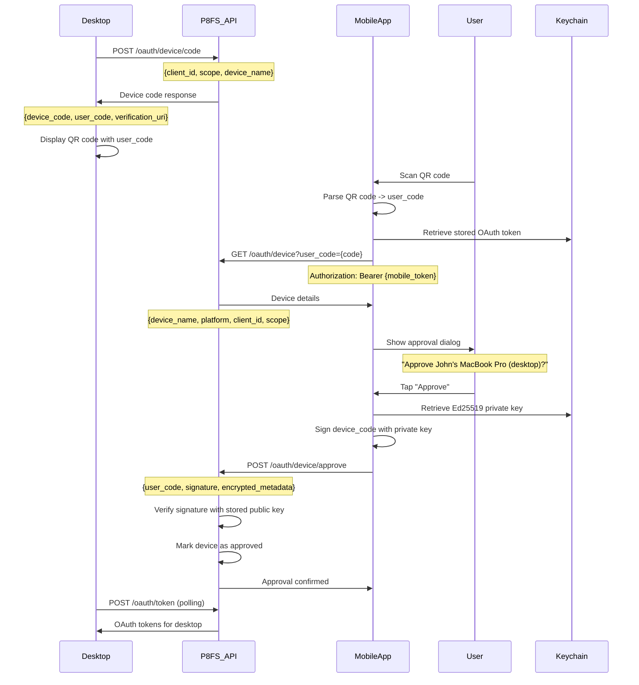
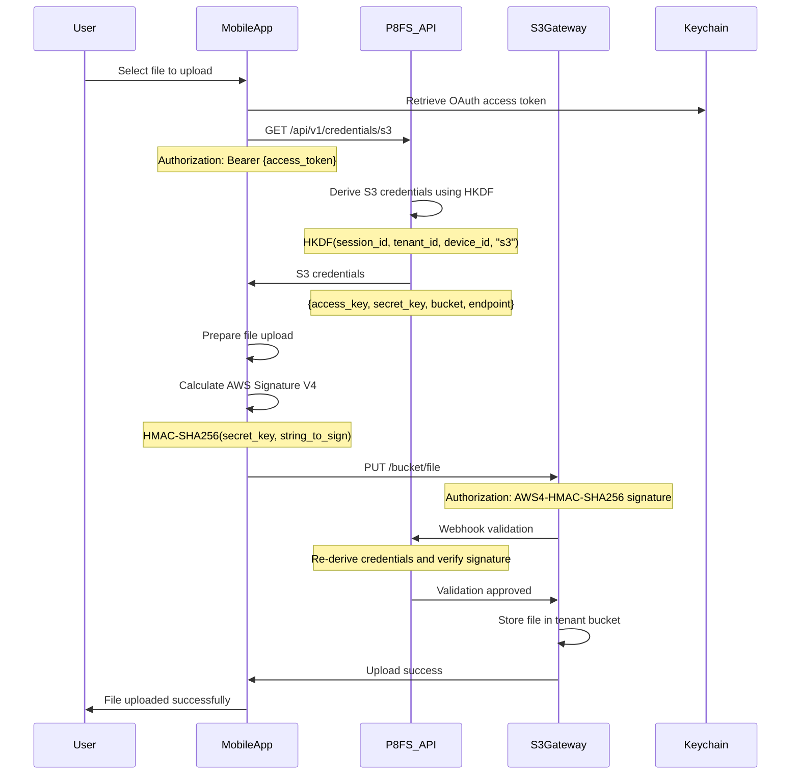
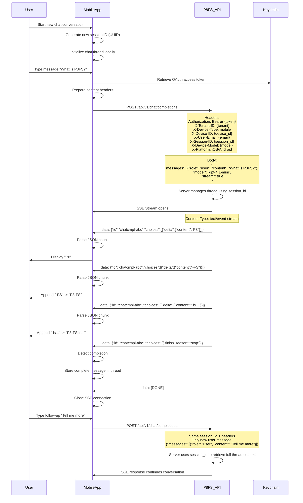

# P8FS Mobile Flows - Pseudo Code

This directory contains pseudo-code implementations for the four core P8FS mobile application flows in both Kotlin (Android) and Swift (iOS).

## Overview

P8FS mobile apps implement four critical flows for secure, distributed file system interaction:

1. **Device Registration** - Initial app setup with Ed25519 keypair generation
2. **Device Approval** - QR code scanning to approve desktop/web clients
3. **S3 Uploads** - Secure file uploads with credential derivation
4. **SSE Chat Parsing** - Real-time chat completions over Server-Sent Events

## Flow Descriptions

### 1. Device Registration Flow

The initial setup flow when a user first opens the mobile app.



**Key Implementation Points:**
- Generate Ed25519 keypair locally (never export private key)
- Store private key in secure keychain/keystore
- Sign challenges with private key to prove device ownership
- Handle OAuth token storage and refresh

### 2. Device Approval Flow

Mobile app scans QR codes to approve desktop/web applications.



**Key Implementation Points:**
- Parse QR codes to extract user codes
- Retrieve mobile OAuth tokens from secure storage
- Sign device codes with Ed25519 private key
- Handle approval confirmation and error states

### 3. S3 Uploads Flow

Secure file uploads using derived S3 credentials.



**Key Implementation Points:**
- Request S3 credentials from P8FS API
- Implement AWS Signature Version 4 signing
- Handle tenant-isolated bucket paths
- Cache credentials until expiration

### 4. SSE Chat Parsing Flow

Real-time chat completions using Server-Sent Events with session management.



**Key Implementation Points:**
- Generate unique session ID (UUID) for each new chat conversation
- Send comprehensive content headers on every request (device info, user context)
- Only send the latest user message, not entire chat history
- Server maintains thread context using session ID
- Store complete assistant responses locally for UI display
- Handle connection errors and reconnection with same session ID
- Parse streaming JSON chunks in real-time with proper error handling

## File Structure

```
docs/pseudo-code/
├── README.md                           # This file - flow explanations and Mermaid diagrams
├── device-registration/
│   ├── DeviceRegistration.kt          ✅ Android implementation with Ed25519 + secure storage
│   └── DeviceRegistration.swift       🚧 iOS implementation (pending)
├── device-approval/
│   ├── DeviceApproval.kt              ✅ Android implementation with QR code scanning
│   └── DeviceApproval.swift           🚧 iOS implementation (pending)
├── s3-uploads/
│   ├── S3Upload.kt                    ✅ Android implementation with AWS V4 signatures
│   └── S3Upload.swift                 ✅ iOS implementation with CryptoKit
└── sse-chat-parsing/
    ├── SSEChatParser.kt               ✅ Android implementation with session management
    └── SSEChatParser.swift            ✅ iOS implementation with URLSession
```

## Key Security Considerations

### Cryptographic Operations
- **Ed25519 Keypairs**: Generate locally, never export private keys
- **Secure Storage**: Use Android Keystore and iOS Keychain exclusively
- **Challenge Signing**: Sign unique challenges to prevent replay attacks
- **AWS Signature V4**: Proper HMAC-SHA256 implementation for S3 uploads

### Network Security
- **TLS 1.3**: All API communications over encrypted connections
- **Certificate Pinning**: Pin P8FS API certificates in mobile apps
- **Token Management**: Secure storage and automatic refresh of OAuth tokens
- **Tenant Isolation**: Ensure all operations are scoped to user's tenant

### Error Handling
- **Graceful Degradation**: Handle network errors and API timeouts
- **Retry Logic**: Exponential backoff for failed operations
- **User Feedback**: Clear error messages without exposing internals
- **Security Logging**: Log security events without sensitive data

## Platform-Specific Notes

### Android (Kotlin)
- Use **Android Keystore** for private key storage
- Implement **OkHttp** for HTTP/SSE connections
- Handle **Android lifecycle** for background operations
- Use **WorkManager** for background uploads

### iOS (Swift)
- Use **Keychain Services** for secure storage
- Implement **URLSession** for HTTP/SSE connections
- Handle **iOS app lifecycle** and background modes
- Use **Background Tasks** for upload completion

## Implementation Files

### Device Registration Flow
- **[DeviceRegistration.kt](device-registration/DeviceRegistration.kt)** - Android implementation with Ed25519 keypair generation, secure storage in EncryptedSharedPreferences, email verification with challenge-response, and comprehensive error handling
- **DeviceRegistration.swift** *(Coming Soon)* - iOS implementation with Keychain Services, CryptoKit Ed25519, and biometric authentication

### Device Approval Flow  
- **[DeviceApproval.kt](device-approval/DeviceApproval.kt)** - Android implementation with deep link handling for QR codes (p8fs://auth), 8-digit PIN field UI, device details fetching and display, and Ed25519 signature-based approval
- **DeviceApproval.swift** *(Coming Soon)* - iOS implementation with URL schemes, biometric approval, and Keychain integration

### S3 Uploads Flow
- **[S3Upload.kt](s3-uploads/S3Upload.kt)** - Android implementation with AWS V4 signature generation, hardcoded SeaweedFS credentials, JWT parsing for tenant isolation, and HKDF-based credential derivation concepts
- **[S3Upload.swift](s3-uploads/S3Upload.swift)** - iOS implementation with CryptoKit HMAC, URLSession uploads, and background task completion

### SSE Chat Parsing Flow
- **[SSEChatParser.kt](sse-chat-parsing/SSEChatParser.kt)** - Android implementation with session ID generation (UUID), comprehensive header management including X-Session-ID, SSE parsing with proper error handling, and support for X-CHAT-IS-AUDIO header
- **[SSEChatParser.swift](sse-chat-parsing/SSEChatParser.swift)** - iOS implementation with URLSessionDataTask, real-time JSON parsing, and background mode support

## API Documentation References

For complete API specifications, see:
- **[../p8fs/authentication.md](../p8fs/authentication.md)** - OAuth 2.1 device flow, Ed25519 key management, and JWT token handling
- **[../p8fs/chat.md](../p8fs/chat.md)** - OpenAI-compatible chat completions API with streaming support
- **[../p8fs/content_headers.md](../p8fs/content_headers.md)** - Complete HTTP header reference for user context and device information

## Next Steps

1. **Review Implementation Files**: Study the Kotlin and Swift pseudo-code in each flow directory
2. **Adapt Architecture**: Modify code patterns to fit your specific mobile app architecture  
3. **Error Handling**: Implement proper error handling and user experience flows
4. **Testing**: Add unit tests for cryptographic operations and network layer
5. **Security Audit**: Perform security audits of key management and network operations

The pseudo-code provides a foundation for implementing P8FS mobile client functionality while maintaining security best practices and user experience standards.